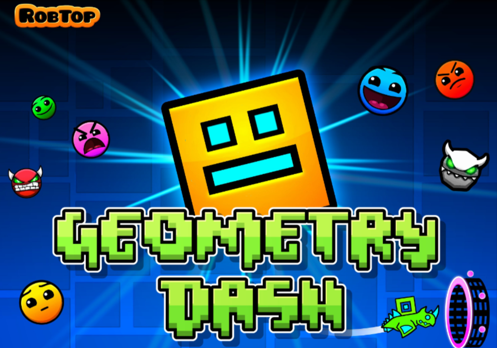

# Geometry Dash


## Introduction

Welcome to Geometry Dash, a simple Java game created using the Swing library in java. In this game, you control a jumping cube, trying to avoid spikes and score points.

## Getting Started

### Prerequisites

- Make sure you have Java installed on your machine.
- You need to download IntelliJ IDEA or VSCode to run this program.


### Installation


1. Navigate to the project folder:
   ```bash
   cd GeometryDash
   ```

2. Run the game:
   ```bash
   javac src/Main.java
   java src.Main
   ```

## How to Play?

- Press the **Spacebar** or click to make the cube jump.
- Avoid the spikes to stay alive.
- Press **R** to reset the game.

## Customization

- Customize the game graphics by replacing the images in the `images` folder.
- Scripts are listed on `src` folder.
- Volume and sounds are listed on `sounds` folder.

### Files 
These are the files located in the `src` folder.

- **Main.java**: This is the main class to run the game.
- **GeometryDash**.java: The main class that represents the Geometry Dash game
- **Cube.java**: Class representing the player's cube.
- **Actor.java**: Class representing in-game actors, like spikes.
- **ZRect.java**: Class representing a simple rectangle in cube class.
- **Sound.java**: Class representing a sound in the game.

## Acknowledge 

Our sincere thanks to the contributors and communities that have played a vital role in shaping Geometry Dash:

- **Developers**: The creative minds who brought Geometry Dash to life.
  
- **Open Source Community**: For invaluable resources and support that enhanced the game.

- **Designers & Sound Engineers**: The talented individuals responsible for the captivating visuals and immersive audio.

- **Beta Testers**: Appreciation for meticulous testing and valuable feedback.

- **Community Contributors**: Everyone who shared ideas and actively participated in discussions.

Geometry Dash is a collaborative effort, and your contributions have been instrumental in making the game what it is today.


### Have fun playing Geometry Dash! 

